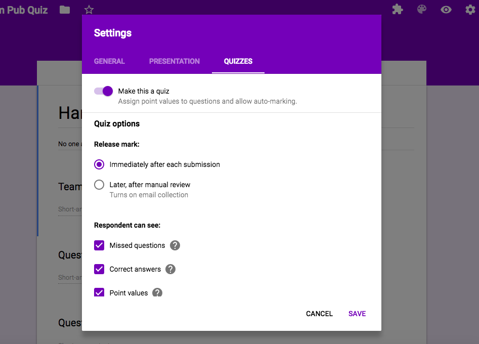
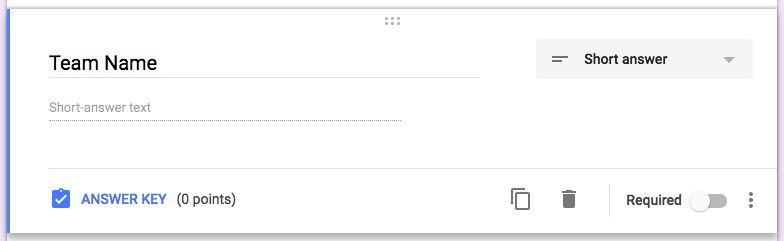
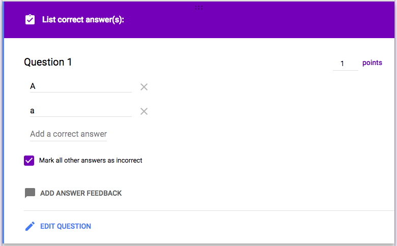
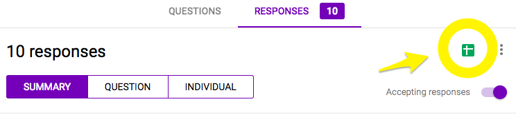
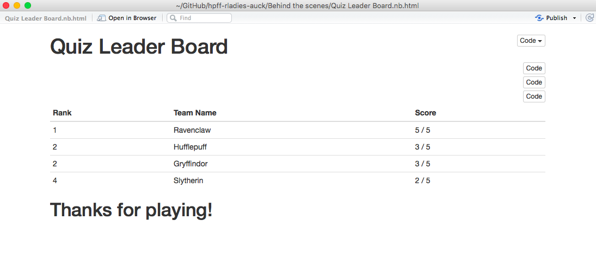

# Running a pub quiz from R
### Some background
This was set up for a [R-Ladies Auckland meetup](https://www.meetup.com/rladies-auckland/events/250117268/).

This talk was about web scraping and was inspired by work I had done to get data to write a Stats 101: Introduction to Statistics exam in 2017. In the spirit of R flavoured fun we have at these meetups, I thought it would be neat to showcase some of the powers of the `rvest` package in a warm up quiz. I doubt this will catch on for your local pub quiz, but maybe this will be of use to you in your own R-Ladies or other R themed groups. 

More information on this talk in the [notes for the talk](http://www.dataembassy.co.nz/links).

Hit me up on [Twitter](https://www.twitter.com/Liza_Bolton) if you have any questions or feedback.

# Ingredients
* Some questions you want to ask in a presentation (can be any format - not linked to anything else)
* A Google Form turned into a quiz with an answer key set up
* Code to scrape the Google Form, write answers and submit them
* A leader board that uses the Google Speadsheet with the responses from the quiz

# Method

### Set up the Google Form

I use [Google forms](https://docs.google.com/forms) a lot and think they're pretty intuitive and useful. [This is the quiz](https://docs.google.com/forms/d/e/1FAIpQLSfvhpZ0LKuUzA0ZRnpIcrzl4JX7eOa111bmsESN54-0mf8Qrw/viewform?usp=sf_link) I set up, but the participants never actually *see* it.

* Set up your Form, and make it a quiz by clicking the Settings gear at the top right.
* Go to the "Quizzes" tab and toggle "Make this a quiz" on.

* Then you can go into each question and set up the answers.
* A team name question doesn't have to have any marks - see the "Answer Key (0 points)"

* You can set your multi-choice questions to be worth a certain number of points, and indicate the correct answer, by clicking "Answer Key" in the bottom left corner of question edit box. I let both captial and lower case 'A' be a correct as it is case sensitive. You could probably do radio buttons as well, but I found this set up the easiest.

* View the spreadsheet that the responses will be saved in by clicking the spread sheet symbol in the "Responses" tab. 

### Set up the quiz R code

Check out the code in **For the workshop/Quiz.Rmd**.

Note the at questions are not included in the file, as for my purposed they are going to be shown as part of the presentation. Each question is multichoice and has three options. You could include the questions in the file if that suited your purposes.

Participants can edit the `your_answers` chunk and then Knit the file to html to see their score (at the bottom), or run the chunks bit by bit.

Preview [here](http://htmlpreview.github.io/?https://github.com/elb0/hpff-rladies-auck/blob/master/For%20use%20in%20workshop/Quiz.html).

### Set up a leaderboard

As I have the Google Form set up to score the quiz automatically, it was nice and easy to use the `googlesheets` package to grab the score data and make a leader board that could be presented quickly at the end of the quiz.

The above is based on running the preview, which is what I would do to actually present the results. The full HTML output isn't quite so pretty, but you can see it [here](http://htmlpreview.github.io/?https://github.com/elb0/hpff-rladies-auck/blob/master/Behind%20the%20scenes/Quiz%20Leader%20Board.nb.html). See the `notes` chunk in **Behind the scenes/Quiz Leader Board.Rmd** for more comments on how I'd use this.
